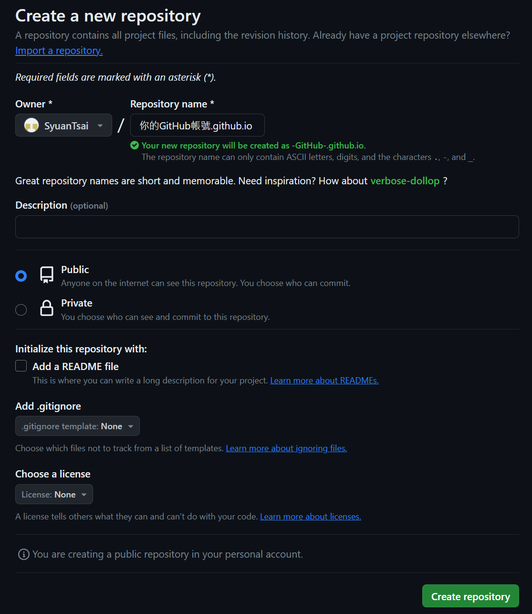

# 使用GitHub建立個人網站
### 步驟

1. 註冊[Github](https://github.com/join)帳號。
2. 建立[新的Repository](https://github.com/new)。
    - Repository Name 請使用「`你的GitHub帳號`.github.io」。
    - 建議使用英文會比較好。
    
    
    
3. 本地建立新的Git。
    
    ```bash
    git init
    ```
    
4. 建立一個Html檔案隨意命名，這邊是用`Test Page.html`。
    
    **如果命名為`Index`的話，則會是你的預設頁面。**
    
    ```html
    <!DOCTYPE html>
    <html lang="zh-Hant">
      <head>
        <meta charset="utf-8">
        <title>你好，GitHub</title>
      </head>
      <body>
        <h1>測試</h1>
      </body>
    </html>
    ```
    
5. 將檔案上傳
    
    ```bash
    git add .
    git commit -m "Test commit"
    git remote add origin git@github.com:SyuanTsai/你的GitHub帳號.github.io.git
    git push -u origin gh-pages
    ```
    
6. 開啟你的網址
    
    ```bash
    https://你的GitHub帳號.github.io/Test%20Page.html
    ```
    

### 更新紀錄

---

**建立時間：2024-01-07**

修改時間：2024-01-07

更新紀錄

| 日期 | 內容 |
| --- | --- |
| 2024-01-07 | new |
|  |  |

### 參考資料

---

- **[使用 GitHub 免費製作個人網站](https://gitbook.tw/chapters/github/using-github-pages)**
- ChatGPT